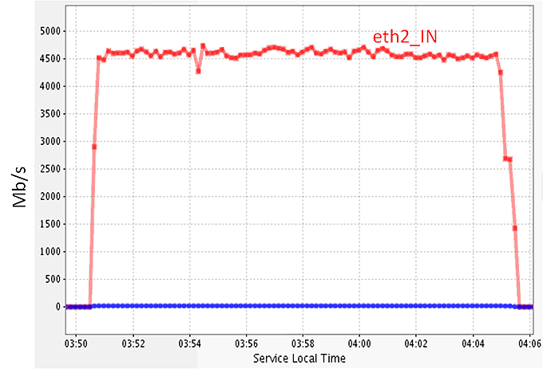
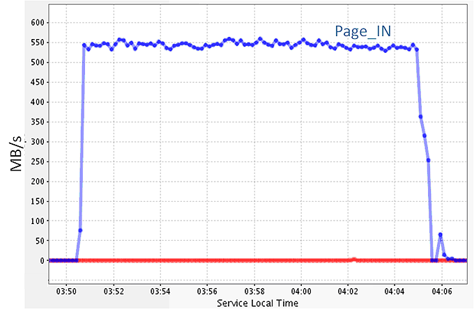
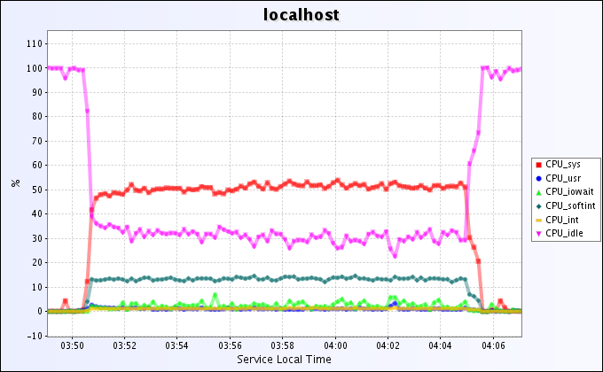
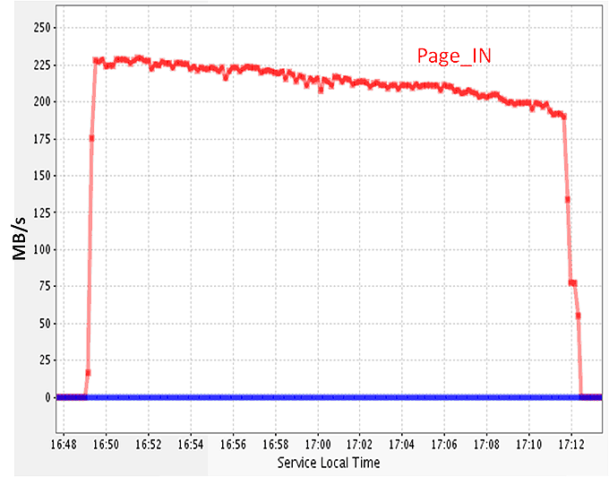

[[Home](index.md)]   [[Documentation](doc-fdt-ddcopy.md)]   [Performance Tests]

[Disk to Disk]   [[Memmory to Memmory](perf-memory-to-memory.md)]   [[SC06](perf-sc06.md)]   [[SC08](perf-sc08.md)]   [[SC09](perf-sc09.md)]

### FDT Disk To Disk I/O Performance over WAN
 

**1. Disk Servers with hardware RAID controllers**
This performance test was done using two disk servers between CERN and Caltech (RTT ~ 170 ms). Each system used a 10Gb/s network card (The system at Caltech has a Myricom card and the system at CERN has a Neterion card)
The connection between the two systems used the USLHCNET for the transatlantic part and Internet2 in US.

The disk servers used:
4U - 2 CPUs Dual Core Intel Woodcrest @ 3.00 GHz, 6 GB RAM, 2 ARECA RAID controllers and 24 SATA HDs.
The system at CERN runs Linux (Ubuntu 7.04) kernel 2.6.21.1
The system at Caltech run Linux (Centos 4.4) kernel 2.6.18
For both systems we used the default TCP congestion control (CUBIC)
MonALISA was used for all the monitoring.
The total transfer rate for data files from CERN to Caltech using the two disk controllers in parallel on both servers is shown in Figure 1.
Total network traffic for disk to disk transfer between CERN and Caltech using two RAID controllers per server

Figure 1. Total network traffic for disk to disk transfer between CERN and Caltech using two RAID controllers per server.

The total Disk IO on the receiving server (Caltech) is shown in Figure 2.

Figure 2. Total disk IO for the receiving server (the writer). The mean value is ~ 545 MB/s.

The CPU utilization for the receiving server (the writer) is presented in Figure 3. The CPU system is ~ 50% and the used for soft interrupts is ~ 15%.

Figure 3. The CPU utilization for the receiving server

**The mean disk to disk transfer rate between the two servers was 545MB/s, which means 1.96 TB per hour.**

If we used only one RAID controller in the data transfer on each server the total transfer rate in shown in Figure 4. In this case the mean total throughput is ~ 2.6 Gb/s or 325 MB/s.

Figure 4. The total network throughput for a Disk to disk transfer between CERN - Caltech, when only 
one RAID controller was used on both servers

##### 2. Simple Servers

This performance test was done using two 1U servers between CERN and MANLAN (New York) (RTT ~ 93 ms). Each system used a 10Gb/s network card (Netrion ) and we used the USLHCNET.

The server used:

2 CPUs Dual Core Intel Woodcrest @ 3.00 GHz, 4 GB RAM, 4 x 320 GB SATA HDs.

FDT was used to read and write on parallel on all four SATA HDs on both servers. The total disk IO for the sender server is presented in Figure 5.

Figure 5. The total disk IO traffic for a data transfer between CERN and MANLAN using in parallel 4 SATA HDs on both servers.

The mean transfer rate was ~ 210MB/s or 0.75 TB per hour.
