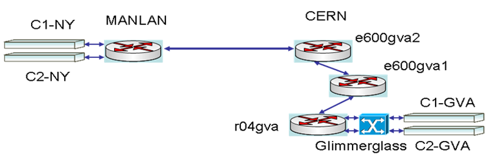
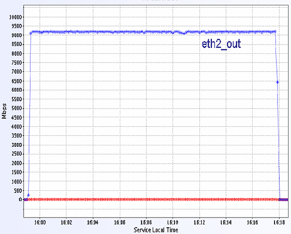
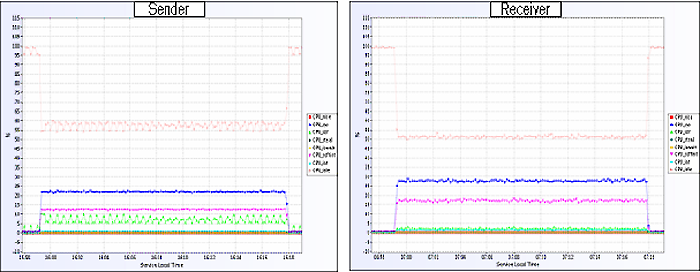
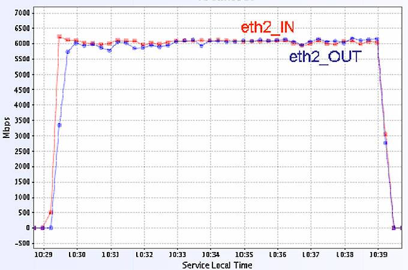
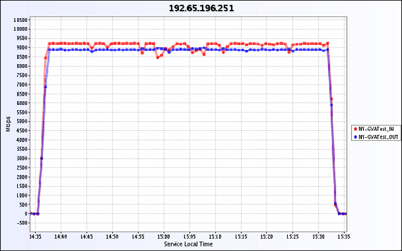
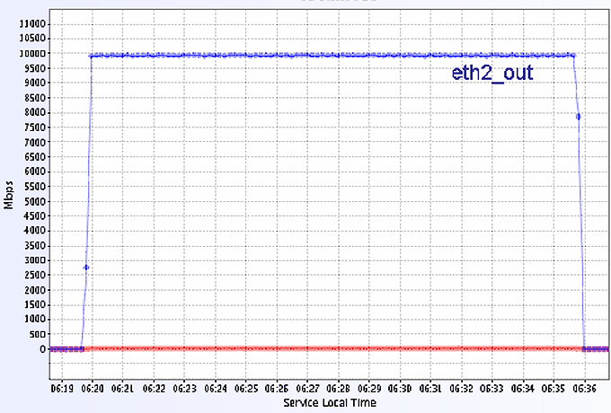

[[Home](index.md)]   [[Documentation](doc-fdt-ddcopy.md)]   [Performance Tests]

[[Disk to Disk](perf-disk-to-disk.md)]   [Memmory to Memmory]   [[SC06](perf-sc06.md)]   [[SC08](perf-sc08.md)]   [[SC09](perf-sc09.md)]

### FDT Tests for Memory to Memory Transfers
##### Setup and Topology

These tests were done on USLHCNET network using the segment between CERN and New York (RTT 93ms).
The systems (Cx-NY and Cx-GVA, x=1,2) used for these tests are:
2 CPUs Dual Core Intel Xenon @ 3.00 GHz, 4 GB RAM, 4 x 320 GB SATA Disks
Connected with 10Gb/s Myricom cards in the routers at CERN and MANLAN. The topology is presented in Figure 1.
We used FDT version 0.5
We used 2.6.18 and 2.6.19 Linux kernels. For the TCP congestion control we used Scalable and Cubic. For both we get very similar results.

Figure 1. Topology of the test environment in using the CERN - MANLAN link

##### Transfers in one direction using a pair of servers
One pair (C1-NY and C1-GVA) was used to test the maximum throughput we can get from one system.
We used 2MB for the TCP buffer size and 35 streams.
The throughput in each direction was very stable at ~ 9.2 GB/s (Figure 2). The CPU utilization for the sender and receiver is shown in Figure 3.

Figure 2. The throughput between C1-NY sender C1-GVA receiver. The TCP buffer size was set to 2MB and we used 35 steams. The RTT is 93ms.

 
 
Figure 3. CPU utilization for the sender and receiver.

##### Transfers in both directions with a pair of servers

We used one pair (C1-NY and C1-GVA) to concurrently send and receive data on the same 10Gb/s interface. The throughput in each direction was ~ 6 Gb/s (Figure 4).
Perhaps the limitation is due to the PCI express bus access to the memory. Testing the throughput on a .localhost. is very close to the aggregated traffic obtained in this test.

 
 
Figure 4. The throughput in both directions between C1-NY C1-GVA. The TCP buffer size was set to 2MB and we used 20 steams for each transfer. The RTT is 93ms.

##### Transfers in both directions with two pairs of servers

One pair of servers (C1-NY and C1-GVA) was used to send data from MANLAN to CERN and the other one to send data from CERN to MANLAN. The measured traffic in the MANLAN router is shown in Figure 5. The total throughput in each direction was quite stable. The Traffic from CERN to MANLAN was ~ 9.2Gb/s and the traffic from MANLAN to CERN was ~ 9Gb/s.

 
 
Figure 5. The throughput in both directions between two pairs of servers. The TCP buffer size was set to 2MB and we used 35 steams for each transfer. The RTT is 93ms

##### Results for Memory to Memory transfers in LAN

The data transfer between the two systems at CERN (C1-GVA to C2-GVA) or MANLAN (C1-NY to C2-NY) runs very close to the theoretical limit of 10Gb/s (Figure 6 ) and is stable. We used 3 streams with 2MB TCP buffer size.

 
 
Figure 6. The throughput in LAN between two servers.
