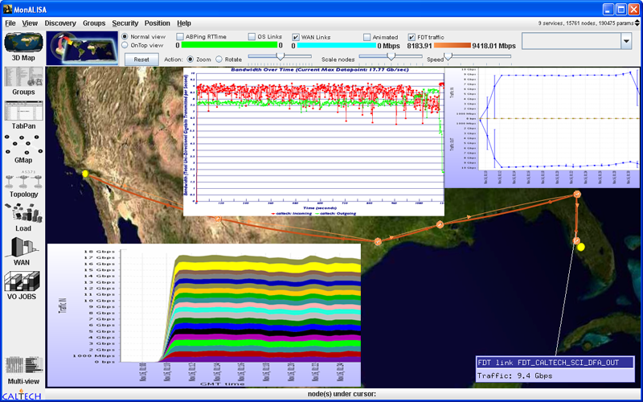

[[Home](index.md)]   [[Documentation](doc-fdt-ddcopy.md)]   [Performance Tests]

[[Disk to Disk](perf-disk-to-disk.md)]   [[Memmory to Memmory](perf-memory-to-memory.md)]   [SC06]   [[SC08](perf-sc08.md)]   [[SC09](perf-sc09.md)]

### Fast Data Transfers at SuperComputing 2006
FDT was used at the Supercomputing 2006, by the Caltech team for the Bandwidth Challenge.

Following the rules set for the SC06 Bandwidth Challenge, the team used a single 10-Gbps link that carried data in both directions. FDT provided sustained total throughput of ~17 Gbps for disk to disk transfer using 10 pairs of small servers (each having 4 SATA HD configured in software raid0 and 1Gb/s network interface) in both directions.

