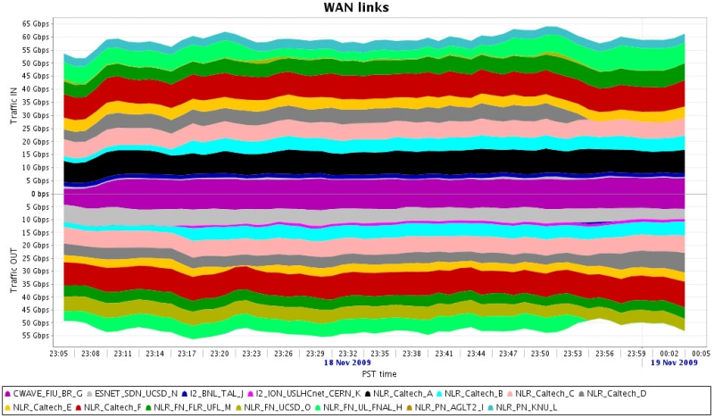

[[Home](index.md)]   [[Documentation](doc-fdt-ddcopy.md)]   [Performance Tests]

[[Disk to Disk](perf-disk-to-disk.md)]   [[Memmory to Memmory](perf-memory-to-memory.md)]   [[SC06](perf-sc06.md)]   [[SC08](perf-sc08.md)]   [SC09]

### Fast Data Transfers at SuperComputing 2009
The focus of the exhibit was the HEP team's record-breaking demonstration of storage-to-storage data transfer using FDT, over wide area networks from two racks of servers and a network switch-router on the exhibit floor. The high-energy physics team's demonstration "Moving Towards Terabit/sec Transfers of Scientific Datasets: The LHC Challenge" achieved a bi-directional peak throughput of 119 gigabits per second (Gbps) and a data flow of more than 110 Gbps that could be sustained indefinitely among clusters of servers on the show floor and at Caltech, Michigan, San Diego, Florida, Fermilab, Brookhaven, CERN, Brazil, Korea, and Estonia. FDT was used at the Supercomputing 2006, by the Caltech team for the Bandwidth Challenge.

